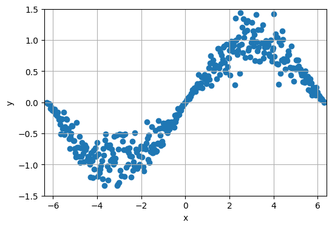
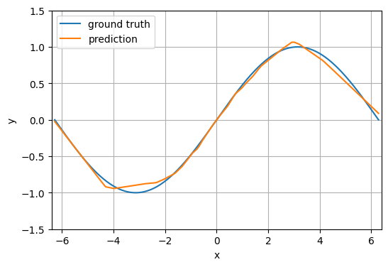
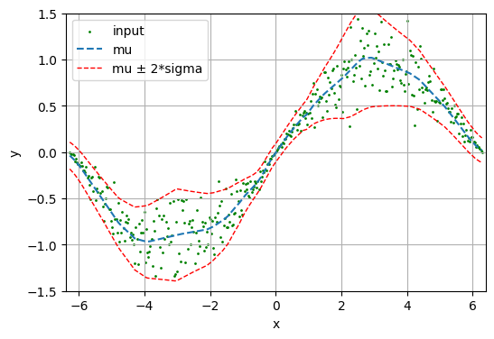

# Introduction
This repo is a simple demonstration for estimating heteroscedastic aleatoric uncertainty in regression tasks with neural network.

Specifically, an additional output channel is added to output layer to estimate the uncertainty. It can be trained unsupervisely with adjusted regression loss:  
$L=\frac{1}{N}\sum{\frac{(y-\mu)^2}{2\sigma^2}+\frac{1}{2}\log{\sigma^2}}$  
where $\mu$ an $\sigma$ represents the original regression output and the new added uncertainty output. For more information, recommend reading the paper [What Uncertainties Do We Need in Bayesian Deep Learning for Computer Vision?](https://arxiv.org/abs/1703.04977)

## Usage
[uncertainty.ipynb in colab](https://colab.research.google.com/github/wang83kc1029/UncertaintyEstimation/blob/main/uncertainty.ipynb)
## Results
input data (sin signal + some noise during observation)  

prediction  

prediction with uncertainty

# Reference
[What Uncertainties Do We Need in Bayesian Deep Learning for Computer Vision?](https://arxiv.org/abs/1703.04977)

# Related links 
[(Chinese) Paper study: What Uncertainties Do We Need in Bayesian Deep Learning for Computer Vision? (1)](https://medium.com/@wang83kc1029/paper-study-what-uncertainties-do-we-need-in-bayesian-deep-learning-for-computer-vision-1-f0ac00305503)  
[(Chinese) Paper study: What Uncertainties Do We Need in Bayesian Deep Learning for Computer Vision? (2)](https://medium.com/@wang83kc1029/paper-study-what-uncertainties-do-we-need-in-bayesian-deep-learning-for-computer-vision-2-c591880af5b4)
